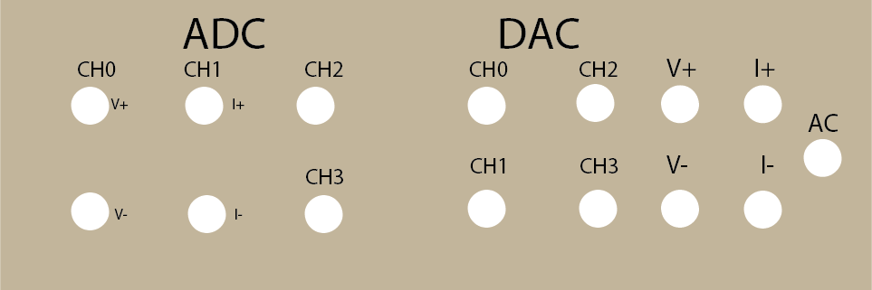
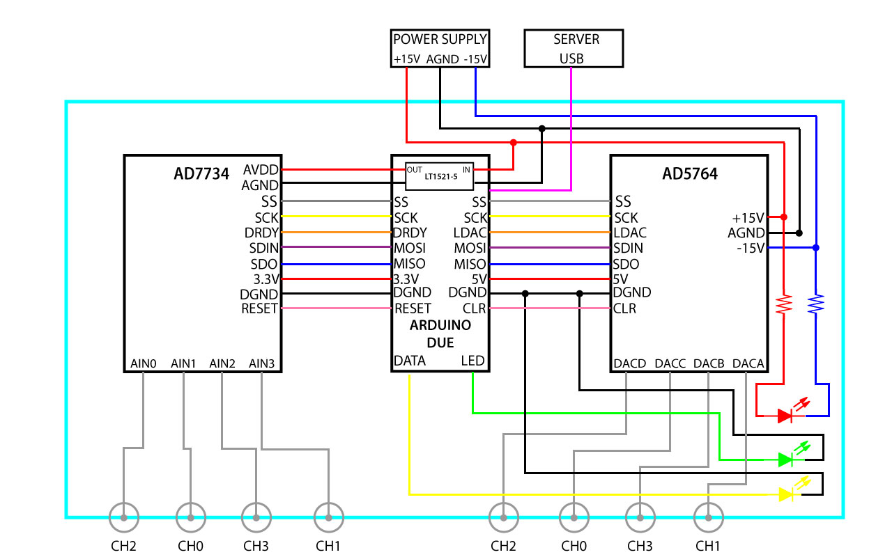

|:--:|
| DAC-ADC |

The DAC-ADC is a self ensembled device designed by [opendac](http://opendacs.com/dac-adc-homepage/ "Opendacs"). You can find all the information about the instrument on their webpage. It contains the following structure:

|:--:|
| DAC-ADC assembly |

The assembly work was done by Dr Matias Timmermans, who improve the proposed structure by introducing an amperemeter and differential voltmeter (I+/I- and V+/V- at the ADC side) and . However, the coupled signal was too noisy, so it is more recommended to use a source that allows introducing an offset or a bias-tee (if the experimental runs are performed at high frequencies). The **DAC-ADC.py** file contains a class to perform the serial string communication with the Arduino Due to send the commands to the evaluation boards. The arduino file **ADC-DAC_ver_mat_2.ino** contains the drivers for the Arduino Due, so a quick (or not that quick) look should be taken in order to understand how it works. 

The first step to communicate with the dac-adc is uploading the drivers to the Arduino if it hasn't been done before. To do so, open the **ADC-DAC_ver_mat_2.ino** file on the arduino due (check the Arduino is recognised) and run the code. Once this is done, python scripts can be used. The second step is opening the connection. Following the functions on the DAC-ADC class it is done the following way:

device = DAC_ADC(port,baudrate,timeout)
Introduce the proper USB port, baudrate (arduino baudrate) and timeout. (These last 2 at your wish)

Then the functions can be commanded. A little example is done at **com_withdac.py**. Open the **DAC-ADC.py** file to check the available functions for DAC and ADC. Each function is properly explained.