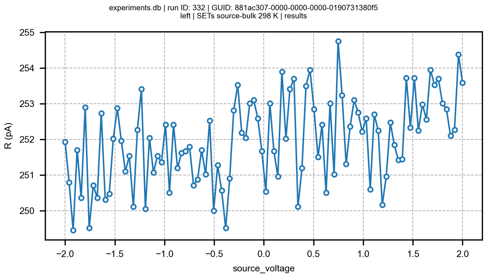

# Characterization of Single Electron Transistors for quantum dot based qubits

## Characterization at UB

To get the AC signal for the loc-in meaurements, at first we started by using the lock-in internal oscillator as the input signal as we could use it as reference for the signal mixing in the lock-in measurement process. We have several choices to couple a DC signal and the AC to perform sweeps thorugh in $V_{ds}$. On one side, we tried to introduce a T connector to couple both signals but it was not very optimal, a big part of the AC signal was lost through the DC ground and to avoid that an impedance (name) was introduced, but getting too much noise within the circuit. Another option is using the DAC-ADC as the design performed by Matias allowed to couple signals and control the sweep via channel 4 (3 in my coding program). However, the new signal was even more noisier. Finnaly, we decided to use an Agilent 33220A and use its sync output to use as the lock-in reference and allows an offset (that can be reduced to $\mu\text{V}$ scale). This way, by controlling it via GPIB we are able to perform voltage sweeps in mV scale to properly measure Coulomb Diamonds. 

## Punch-Through measurements

One of the problems we might get from the devies is the punch-through effect where, due to the big size of the depletion regions createn at the N-P junctions, a non desirable current channel can be created from source to drain. However, it was seen in simulations that this effect should be decreased with temperature. Thus, I performed several $V_{ds}$ sweeps with the same 4 $\mu\text{m}$ channel length MOSFET to see how the current varies. To do so, I left the gate lead in open circuit and got the following characteristic curves for different temperatures:

### Agilent_33220A class:
Here I just built a simple class for the **Agilent_33220A** device. It is only useful to connect the device via GPIB and set an offset value. It is possible to include more functions to perform other actions. To do so, you can read the device's manual as it explains the strings to communicate with the device.

After measuring the values of the output signal with the lock-in I realized the peak to peak value stated in the is not exact. With the voltage divider of factor 667, we reduce the amplitude by 1000 more or less, so the peak to peak is slightly bigger than stated in the panel. The offset shown is also the double so we need to consider it when applying the voltage sweeps.

## SET CHARACTERIZATION

First step to 

## Characterization 01/07 with Gorka

We introduced a device with two chips and first measured the lead gates resistivity by introducing a 105 $\mu$V AC lock-in amplitude to measure the conductance. The device on the left showed a high resistivity around 70 $\text{M}\Omega$, this could be due to failed contacts or aluminium dot deposition errors while in the other a resistivity of 23 $\text{M}\Omega$ a more logical one was measured. Afterwards we measured the resistivity of the barrier gates, which due to the aluminium oxide should show a much higher resistivities. Thus, by applying a 50 $\mu\text{V}$ AC voltage we measured values of current around 50 fA, having values of impedance larger than 1 G$\Omega$. However, the values of current are in reality much lower as they achieve noise levels, approximating the real impedance to be higher than 100 $\text{G}\Omega$. The resisitivity between barriers was measured to be around 210 $\text{M}\Omega$. For the second device, the resistivity between gate lead and barriers was measured to be smaller around 200-300 $\text{M}\Omega$ and the resistivity between barries 440 $\text{M}\Omega$. 

While the cryostat was getting cooled down, we performed $V_{ds}$ sweeps to try observe the punch-thorugh in SETs. However, the lock-in could not measure any substantial current changes as it should be expected. Nothing relevant was observed and sometimes looked like any contanct was made as the drain output showed oscillations as if some measuring terminal was not making proper contact

When reducing the temperature to 25 K we repeated the resistivity process and get unexpected results since for the device on the left it looked like infinite resistance and the one on the right remained the same when it shoul have been reduced due to temperature shift. Moreover, we tried to see the current lost through the bulk, seeing the magnitude of the differential conductance gets higher but without apparent changes through voltage sweeps:

Finally, we performed lead gate voltage sweeps, by introducing a 1 $\text{M}\Omega$ resistance in the gates to reduce the current through them (to avoid burning the devices), however a higher impedances should be used, unfortunately we didn't have them available. A 100 mV constant Source to Drain voltage was applied and an interensting behavior was observed looking like the gate threshold voltage was around 0.6 V, but without anything certain as it looks too noisy.

The last thing I did with these devices was measureing the parasitic diode in room temperatures to see if something changed.

Device on the left:

Device on the right

It can be seen that the current value is decreased by an order of magnitude in room temperature. Clearly something wrong is going on with cold temperatures, devices might suffer with the setup.