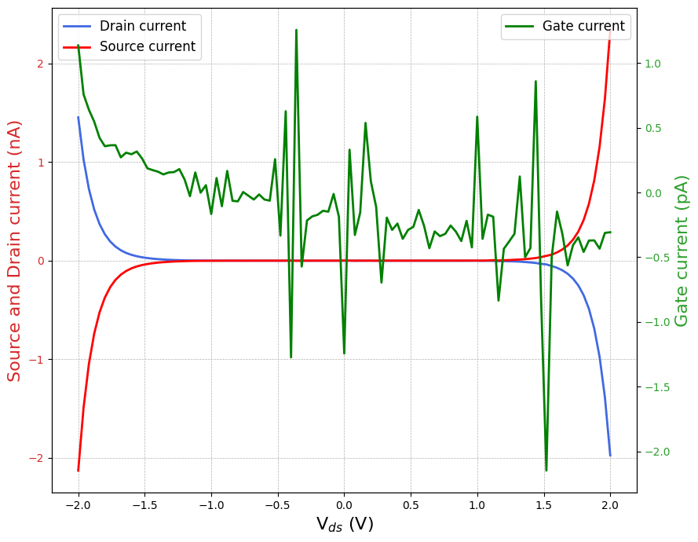
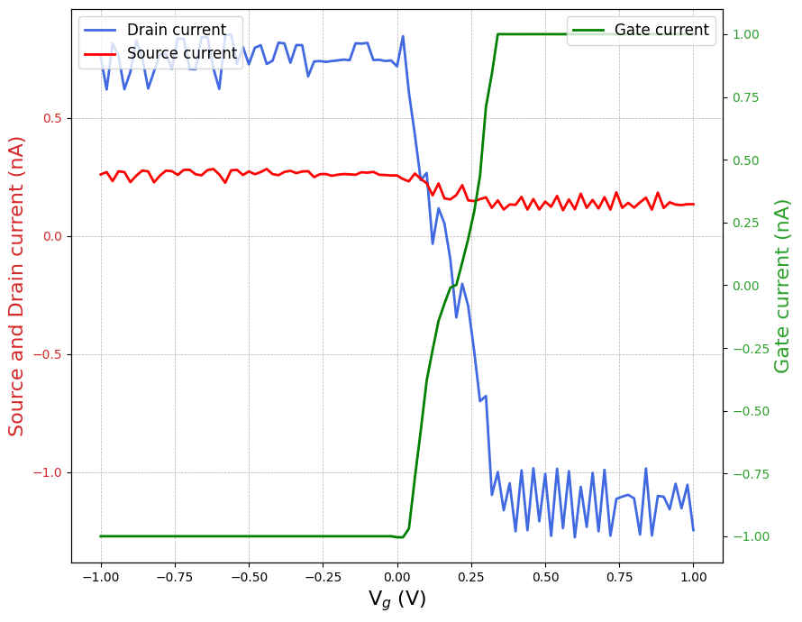
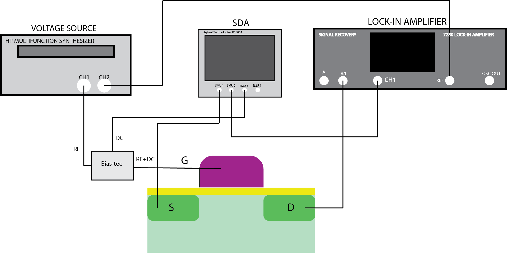
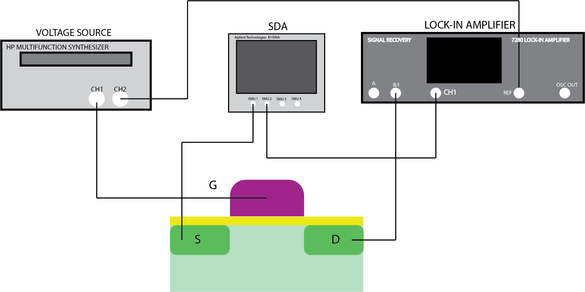
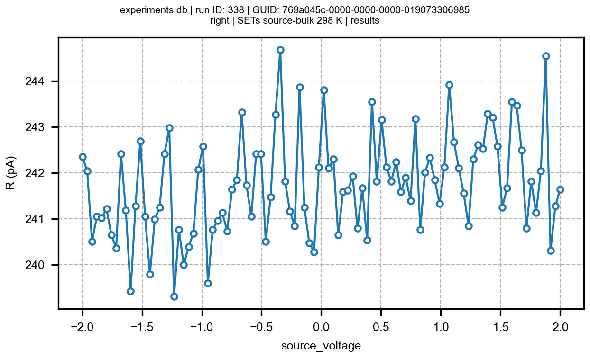

# Characterization of Single Electron Transistors for quantum dot based qubits

The objective of this project is setting up the characterization station for Single Electron Transistors. 

## MOSFET characterization
SET fabrication is based on MOSFET architecture so the devices fabricated at IMB-CNM cleanroom also contain MOSFETs with same channel and source-to-drain lengths. This way, if MOSFETs do not show proper functionality it is likely the SETs either do. 

During my TFM three different wafers have been measured with different I/V characteristics and slightly different fabrication steps. Nanodevice fabrication is not straightforward, and therefore, it is normal observing bad behaviour in the first wafers. However, a good improvement has been demonstrated throguh the new wafers.

### Wafer 1 characteristics:

We performed DC I/V sweeps to check the functionality of the MOSFETs from the first wafer and realized the gate contact was not properly opened, as it didn't reached the active area. Thus, when performing a gate voltage sweep we would only measure noise.

|:--:|
| Source, drain and gate current vs $V_{g}$ |
However, the source-to drain current coul be visualized:

|:--:|
| Source, drain and gate current vs $V_{sd}$ |
This was done with a semiconductor device analizer so there is no code in the repository employed for this sweeps.

### Wafer 2 characteristics:
After some improvements in the fabrication, the gate contact was opened but not properly, as it can beseen in the graphs below, most of the current was lost through the gate,a s if source and gate would be short-circuited. This could happen due to sputtering methods leaving underised metallic residues in the active area as lift-off could not take it away.

|:--:|
| Source, drain and gate current vs $V_{g}$ |
However, the source-to drain current coul be visualized:

|:--:|
| Source, drain and gate current vs $V_{sd}$ |

As it can be seen, in both cases the gate current reaches compliance. This might also be due to wire-bonding not being good and breaking the field oxide short-circuiting bulk and gate.
### Wafer 3 characteristics:
More fabrication improvements were finally enough to create functional MOSFETs. This were nonetheless measured in a probe station at 13 K, so the problems of wire-bonded samples might still appear:

|:--:|
| Source current vs $V_{g}$ for different $V_{ds}$. Log y axis |
However, the source-to drain current coul be visualized:

|:--:|
| Source current vs \V_{sd} for different $V_{g}$.  Log y axis |

As this MOSFETs show proper behaviour, it is expected that the SETs will also show good lead gate modulation.

# SET characterization

## Characterization at IMB-CNM
As SET characterization involves complex setups, it is useful to test it before with other semiconductor devices, such as functional MOSFETs, to be sure it the station is ready to be used for SETs. Therefore, we tested the following setup to measure differential conductance of MOSFET devices at gate voltage sweeps.

|:--:|
| *Setup for 101 kHz* |

As a bias-tee is employed to couple DC and AC, the lock-in signal's freqeuncy must be bigger than 100 kHz, which is not ideal. Due to probe noise we introduced a 10 mV AC amplitude and measure.

|:--:|
| Lock-in conductance and DC current vs $V_{g}$. $V_{ds}=510$ mV and $V_{AC}=10 mV$. |
To measure the characteristics at lower frequencies, we take the bias tee out, but perform the gate sweep manually:

|:--:|
| *Setup for 171 Hz* |
This case, we applied a 100 $\mu\text{V}$ and 171 Hz AC signal. Due to probe point movements (caused by the turbomolecular pump to create the ultra high vacuum) both signals look noisy.

|:--:|
| Lock-in conductance and DC current vs $V_{g}$. $V_{ds}=230$ mV and $V_{AC}=100 \mu V$. |

## Characterization at UB

To perform the measurements at UB, we employed GPIB and serial connections to control the experimental runs from the PC. The documentation of the scrips is done in the following lines:

### Code documentation:

Each script is explained shortly. More explanations are given in the files. To pot it in a general context, **Qcodes** libraries have been employed as it allows us to get the proper drivers of the instrumentation, gather it properly into a station to get proper simultaneous control of them. Moreover, we are able to plot live data with *plottr-inspectr* as it reads and plots the data. Additionally, it is possible to export the data of a given id run. Before running the codes, be certain the packages are downloaded in the python environment, I recommend downloading Anaconda to create a practical environment. You can download it from [Anaconda](https://docs.anaconda.com/anaconda/install/windows/ "Windows"). Once downloading, follow the steps to install and get ready qcodes libraries. A good explanation is found in [qcodes](https://microsoft.github.io/Qcodes/start/index.html "qcodes installation") where you can also find a short introduction to qcodes. At the beginning, it might be a bit annoying, as an extrict parameter implementation must be done, but once getting used to that, it is easy and very comfortable to use. I recommend writing the scripts on Visual Studio Code as it has a good communication with the terminals and kernel environments. Numpy and matplotlib are also required to be installed, but that can be directly done from the terminal "pip install ...". Here I will make a division between the instrumentation that already got drivers at qcodes and the ones that don't. If the drivers are already included at the library, it is straightforward to use them by importing (to see how it is done, chech *my_devs.py*). For instance, agilent 33220a is not included so I had to create a short class to manipulate the offset (the string for GPIB commands was found in the instrument manual).
  -**agilent_33220a.py:** a class to communicate and set the offset of the agilent function generator. I used them to perform the lock-in dc offset sweeps.
  -**DAC-ADC:** a dac-adc designed by [opendac](http://opendacs.com/dac-adc-homepage/ "Opendacs"), it allows us to perform several experimental actions. It operates with an Arduino Due that communicates with DAC and ADC evaluation boards. Every information about the device is given at [opendac](http://opendacs.com/dac-adc-homepage/ "Opendacs"). The file presents a class for the device to call the functions of the Arduino from python via serial string communication.
The following files are used to get the station and datasets ready to perform:
  -**my_devs.py:** gathers the instrumentation up. In my case the lock-in, the agilent source and the dac-adc.
  -**database.py:** creates the .db database where we will save the runs.
  -**plottr-inspectr** to plot live data, first plottr-inspectr must be downloaded in the conda environment (pip install plotr) [plottr](https://github.com/toolsforexperiments/plottr#inspectr-qcodes-dataset-inspection-and-live-plotting "install guide"). You can call it from the terminal GUI by writing plottr-inspectr and it should be launched. Then just load the database and every experimental run perfomed in the database will be shown, splitting them according to the days the runs were performed.
  -**export_data.py:** once my codes include creating .txt files to save the data but it is easy to forget changing the names and getting the files overwritten. Thus, it is easier to export the data by applying this function. a .csv is created, so when reading the data to plot, the separation must be "\t" and not " ", as it is for .txt files.

For experimental runs you will realize that the files are almost similar, just changing the initial and final values or the parameter names. Each file's name is the performed experimental run:
  - **General_code_v1.py:** this code contains the same functions of the dac-adc class but without creating any class. It is the same though, but done before abd can be used to fix the values of the teminals.
  -**Barrier_conductance.py:** file to perform the barrier conductance run.
  -**Main_oscill.py:** file to perform coulomb oscillations run.
  -**DC_mosfets.py:** DC run to measure mosfet characteristics.
  -**Main_diamonds.py:** this code performs a 2D plot, so it slightly differs from others.

To plot data, **plot_data.py** can be used. Just take care when introducing the separation depending on the file you are exporting. Within the jupiter notebook you can check the example plot is being done at each case.

###
To get the AC signal for the loc-in meaurements, at first we started by using the lock-in internal oscillator as the input signal as we could use it as reference for the signal mixing in the lock-in measurement process. We have several choices to couple a DC signal and the AC to perform sweeps thorugh in $V_{ds}$. On one side, we tried to introduce a T connector to couple both signals but it was not very optimal, a big part of the AC signal was lost through the DC ground and to avoid that an impedance (name) was introduced, but getting too much noise within the circuit. Another option is using the DAC-ADC as the design performed by Matias allowed to couple signals and control the sweep via channel 4 (3 in my coding program). However, the new signal was even more noisier. Finnaly, we decided to use an Agilent 33220A and use its sync output to use as the lock-in reference and allows an offset (that can be reduced to $\mu\text{V}$ scale). This way, by controlling it via GPIB we are able to perform voltage sweeps in mV scale to properly measure Coulomb Diamonds. 

### Punch-Through measurements

One of the problems we might get from the devies is the punch-through effect where, due to the big size of the depletion regions createn at the N-P junctions, a non desirable current channel can be created from source to drain. However, it was seen in simulations that this effect should be decreased with temperature. Thus, I performed several $V_{ds}$ sweeps with the same 4 $\mu\text{m}$ channel length MOSFET to see how the current varies. To do so, I left the gate lead in open circuit and got the following characteristic curves for different temperatures:

### Agilent_33220A class:
Here I just built a simple class for the **Agilent_33220A** device. It is only useful to connect the device via GPIB and set an offset value. It is possible to include more functions to perform other actions. To do so, you can read the device's manual as it explains the strings to communicate with the device.

After measuring the values of the output signal with the lock-in I realized the peak to peak value stated in the is not exact. With the voltage divider of factor 667, we reduce the amplitude by 1000 more or less, so the peak to peak is slightly bigger than stated in the panel. The offset shown is also the double so we need to consider it when applying the voltage sweeps.

## Characterization 01/07 with Gorka

We introduced a device with two chips and first measured the lead gates resistivity by introducing a 105 $\mu$V AC lock-in amplitude to measure the conductance. The device on the left showed a high resistivity around 70 $\text{M}\Omega$, this could be due to failed contacts or aluminium dot deposition errors while in the other a resistivity of 23 $\text{M}\Omega$ a more logical one was measured. Afterwards we measured the resistivity of the barrier gates, which due to the aluminium oxide should show a much higher resistivities. Thus, by applying a 50 $\mu\text{V}$ AC voltage we measured values of current around 50 fA, having values of impedance larger than 1 G$\Omega$. However, the values of current are in reality much lower as they achieve noise levels, approximating the real impedance to be higher than 100 $\text{G}\Omega$. The resisitivity between barriers was measured to be around 210 $\text{M}\Omega$. For the second device, the resistivity between gate lead and barriers was measured to be smaller around 200-300 $\text{M}\Omega$ and the resistivity between barries 440 $\text{M}\Omega$. 

While the cryostat was getting cooled down, we performed $V_{ds}$ sweeps to try observe the punch-thorugh in SETs. However, the lock-in could not measure any substantial current changes as it should be expected. Nothing relevant was observed and sometimes looked like any contanct was made as the drain output showed oscillations as if some measuring terminal was not making proper contact

When reducing the temperature to 25 K we repeated the resistivity process and get unexpected results since for the device on the left it looked like infinite resistance and the one on the right remained the same when it shoul have been reduced due to temperature shift. Moreover, we tried to see the current lost through the bulk, seeing the magnitude of the differential conductance gets higher but without apparent changes through voltage sweeps:

Finally, we performed lead gate voltage sweeps, by introducing a 1 $\text{M}\Omega$ resistance in the gates to reduce the current through them (to avoid burning the devices), however a higher impedances should be used, unfortunately we didn't have them available. A 100 mV constant Source to Drain voltage was applied and an interensting behavior was observed looking like the gate threshold voltage was around 0.6 V, but without anything certain as it looks too noisy.

The last thing I did with these devices was measureing the parasitic diode in room temperatures to see if something changed.

Device on the left:

Device on the right

It can be seen that the current value is decreased by an order of magnitude in room temperature. Clearly something wrong is going on with cold temperatures, devices might suffer with the setup.

## Characterization 04/07

First I started to measure DC currents with the ADC as it looks like Matias assembled a current to volt converter within extra components in the ADC. To do so, by introducing 100 mV in a 100 $\text{k}\Omega$ resistor, I measured